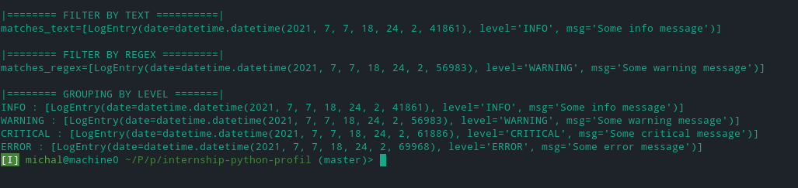

# Moj własny logger - zadanie stażowe Profil
#### Michał Wilk


Kod został sformatowany narzędziem [black](https://github.com/psf/black). 
Sprawdzony pod względem poprawności z regułami PEP8 
narzędziem [pycodestyle](https://github.com/PyCQA/pycodestyle).
Type-checki zostały przeprowadzone za pomocą 
narzędzia [pyright](https://github.com/microsoft/pyright).

Dokumentacja zgodna z narzędziem [sphinx](https://www.sphinx-doc.org/en/master/).

Aby być pewnym co do braku dependecji projektu, sugeruję 
stworzenie środowiska wirtualnego 
[virtualenv](https://docs.python.org/3/library/venv.html) z dependecjami z pliku
requirements.txt (plik ten jest pusty).

Oprócz tych narzędzi, nie wykorzystano żadnych innych bibliotek.

Wykonano testy integracyjne i jednostkowe za pomocą wbudowanej
biblioteki [unittest](https://docs.python.org/3/library/unittest.html).

Dla systemu unix (macOS, linux) należy wywołać poniższe 
komendy w powłoce shell **bash** w folderze z projektem.

```bash
mkdir .venv
python -m venv .venv
source .venv/bin/activate
pip install -r requirements.txt
```

Można ten krok pominąć.

---

## Przykładowe użycie biblioteki
Wyjście pliku *example_usage.py*.

Więcej przykładów użycia biblioteki można znaleźć w folderze *tests*.

